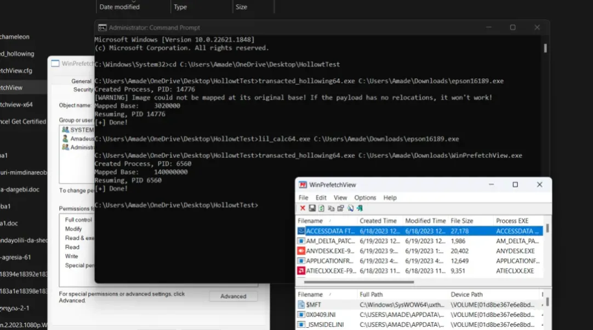
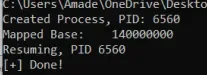
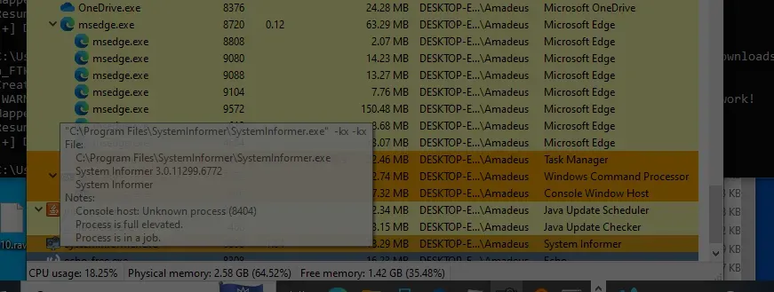
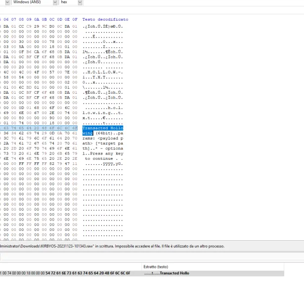
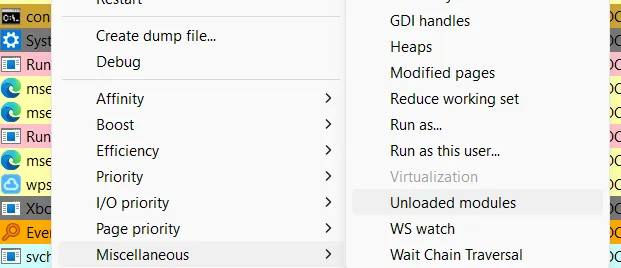
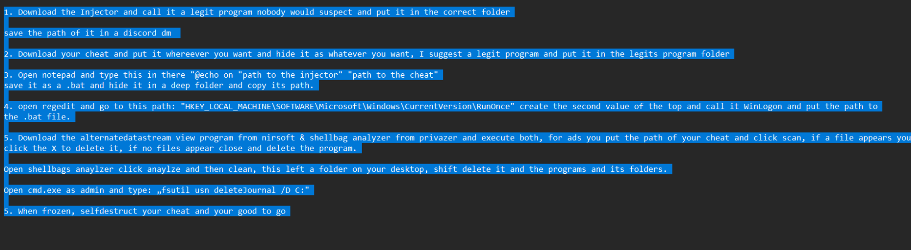

- The hollowing tool used is an .exe so it logs in Prefetch `(image1)`
> Prefetch trace will not generate with Transacted hollowing if users drag & drop the cheats onto hollow tools themselves
- It creates a new suspended process under the PID `(image2)`
- PeSieve or Hollows Hunter can detect it if you use it immediately in the SS since exiting the hollowed process will terminate the task.
- Otherwise you can detect it in WinPrefetch by loaded .exes `OR` system informer `(image3)`
> It creates an elevated task, which is also hidden so it might be hidden under a service it was assigned to
- Hollow tools log in Registry service or Registry Explorer (Ctrl+F + .exe) 
> Bypassers, due to their monkey intelligence, only use github public hollow tools and rename them. Use USN Journal and search `hollow`, maybe they renamed it! (clearing journal and so on is a different story)
- Just like Kernel live dump, using Dumpit to gather a `.mem` capture can potentially display commands / contents of the hollow tools `(image4)` (use ImHex or HxD to read it)
- Lately what the bypassers do is - they load a .dll cheat into CMD as a module `(image5)`, so if you find highly elevated, suspended or "awaiting start" services in System Informer (coloured in light grey, dark grey, orange), right click on them > miscellaneous > unloaded modules (considering they haven't closed the service) `(image6 and 7)`
- If they've closed their cheat / service they loaded into, simply do everything you've learnt from Lotus regarding .dll injections. 
> Is it possible to recover all the modules of closed services? not always, not effectively and most importantly - __not necessary__ since all you need to do is find the cheat, in which mostly:

(1). Using INXDRipper and/or MFT then sorting all the data by `Date Modified` or `Date Accessed` on .dll files can potentially help finding the cheats.
(2). Sometimes while downloading cheats they select a legitimate file and replace their cheats in their place, so using USN Journal to filter `renamed from` `.crdownload` (basically browser download traces) and `renamed to` `input date of .crdownload` can potentially also give some info (tedious work, I'd not recommend unless you can check at least 5 files a minute this way)
(3). Using $MFT on date access on .dlls can also potentially help
(4). DPS still logs hollow tools and so on... 
(5). Use Ocean with an API (for antiviruses) and / or all the automated methods!

## Startup Hollowing
(1) - Check regedit for `HKEY_LOCAL_MACHINE\SOFTWARE\Microsoft\Windows\CurrentVersion\RunOnce` | double click on `WinLogon` and check which .bat file is scheduled on startup then just see what that .bat does
(2) - Use registry Explorer to check if that key is deleted
-----
(3) Use search everything and filter `.bat utf8content:"@echo on"` that'll find the .bat file
(4) Dump searchindexer / pcasvc for .bat files
(5) The injector and injected cheat will still log in csrss and searchindexer. Every other method for general detections works. `Refer to BAM methods`

