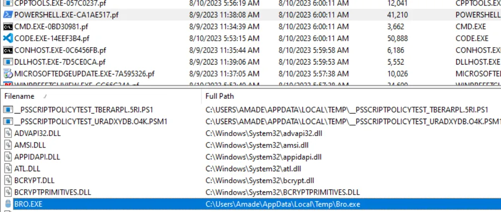
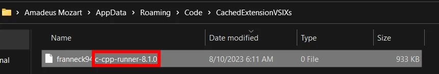
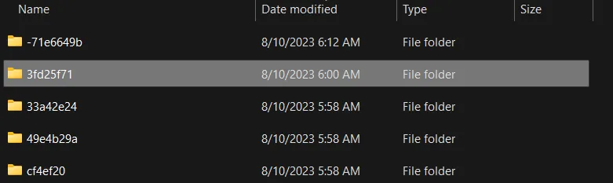
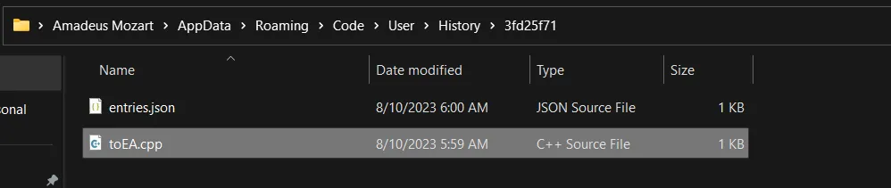
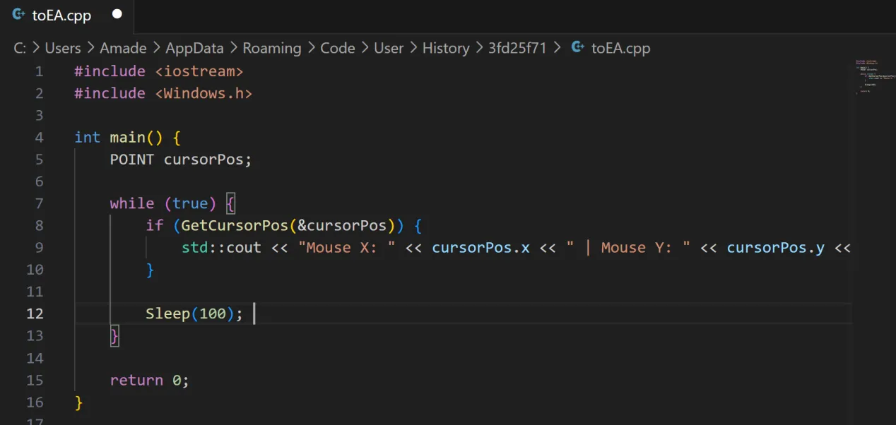

**WinPrefetchView** is way too good.
----------------------------------------
- Using WinPrefetchView, we can still see what scripts or executions were initiated by scripting environments, what files were potentially run using scripting environments and so on.
> **First example** will be executing a Registry Hijack script in CMD (the file itself will also log in prefetch unless it was executed using a __remote configured scheduled task__ or a scheduled task that waits for a specific event ID to be logged); as you can see, we're able to see what file was executed using powershell.
> **Second example** shows 
- Since I don't have any screenshots of other coding environments, I'll explain the approach I usually take when dealing with them.
> For example with **VSCode** - after analyzing Prefetch you'll see where its main source of importing codes comes from;
> - I first check what dependencies the user has installed, for example, in cached extensions directory
> `C:\Users\Amade\AppData\Roaming\Code\CachedExtensionVSIXs` [ Image 2 ]
> "CPP Runner" (C++) will make you assume they might've executed a .cpp script which will help you continue the research using system informer;
> - Then, I'll check the history of user's loaded scripts by going to 
> `C:\Users\Amade\AppData\Roaming\Code\User\History\3fd25f71`
> As you can see on the 3rd image - folders have current date. Go to one of them and load all scripts you see to check what was cached.
> - This shows that I imported a code that monitors mouse movement 😄

